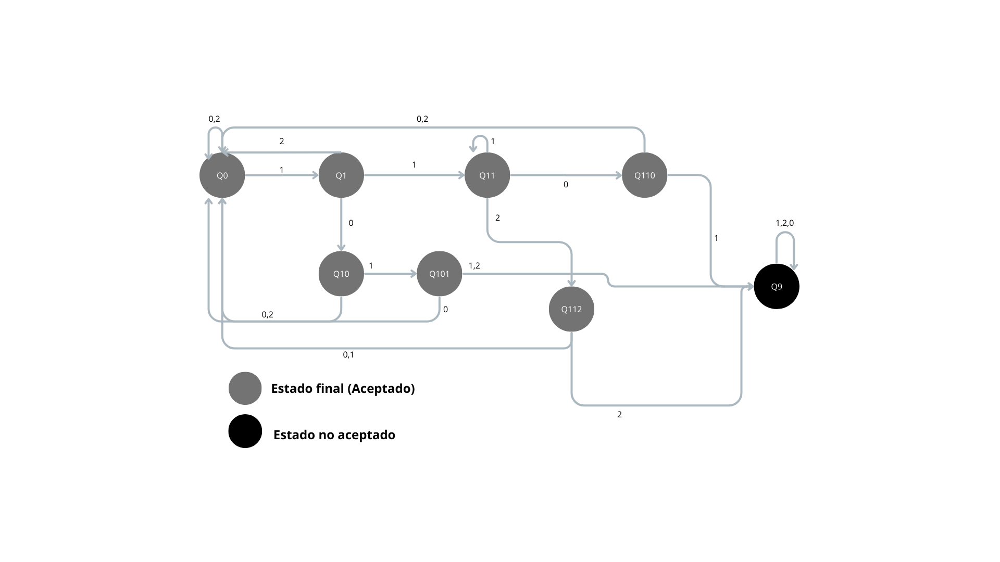
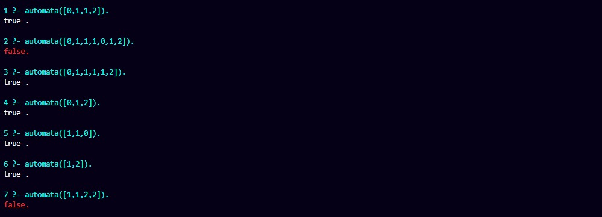

# E1 Implementación de Análisis Léxico (Autómata y Expresión Regular)

Emilio Antonio Peralta Montiel A01712354

## 🔢 Introducción

Este repositorio contiene el desarrollo del proyecto que genera todas las posbles combinaciones de los digitos 0 , 1 y 2, 
determinando si el input a comprobar entra dentro del lenguaje comprobando que sean los caraccteres del lenguaje y que no contenga
las siguientes secuencias:

- 1101 
- 1122
- 1011
- 1012

Viendo este caso se optó por el desarrollo y aplicación de un Automata no Determinístico Finito (Por sus siglas en inglés NFA) brindando flexibilidad y una mejor apreciación de como actua el lenguaje.

## 📌 Diseño

Para el lenguaje Σ={0,1,2}, se deben rechazar todas las cadenas que contengan las subcadenas 1101, 1122, 1011 o 1012. Estas restricciones son análogas a las del ejemplo original, adaptadas al alfabeto numérico.

---



---

Esta es la versión final del autómata. A continuación, explico la lógica utilizada para su diseño, estructurada en párrafos para mayor claridad.  

Las cadenas prohibidas son:  
- **1101**  
- **1122**  
- **1011**  
- **1012**  

Todas estas secuencias comparten un patrón crítico: **comienzan con el símbolo "1"**. Este detalle es fundamental para la construcción del autómata. Cuando el autómata se encuentra en el estado inicial Q0, leer un "0" o un "2" no representa ningún riesgo de iniciar una secuencia prohibida. Por ello, en esos casos, permanece en Q0, ciclando en ese estado hasta detectar un "1". Al leer un "1", el autómata avanza a un estado intermedio Q1 para comenzar a rastrear posibles secuencias prohibidas.  

Desde Q1, el autómata evalúa el siguiente símbolo para determinar si continúa una secuencia prohibida. Si el símbolo no contribuye a formar ninguna de las secuencias bloqueadas (por ejemplo, un "0" o "2" en contextos irrelevantes), el autómata regresa a Q0, reiniciando la búsqueda desde el inicio. Sin embargo, si el símbolo sí forma parte de una secuencia crítica (como otro "1" para las secuencias "1101" o "1122"), el autómata avanza al estado Q11 para monitorear la progresión de la cadena.  

El estado Q9 juega un rol decisivo: actúa como **estado de rechazo absorbente**. Si en cualquier punto se detecta una secuencia prohibida, el autómata transita a Q9 y permanece allí indefinidamente, sin importar los símbolos subsiguientes. Esto garantiza que, una vez identificada una violación, la cadena sea rechazada.  

La estrategia del autómata se basa en tres principios: **eficiencia**, al activar estados intermedios solo ante símbolos críticos; **prevención**, al reiniciar la búsqueda ante símbolos irrelevantes; y **cerrazón**, al bloquear el rechazo definitivo tras detectar una secuencia prohibida. Este diseño asegura que el autómata opere de manera óptima para el alfabeto , cumpliendo estrictamente con las restricciones impuestas trabajando de la siguiente manera:


| E | 0 | 1 | 2 |
|---|---|---|---|
|Q0 |Q0|Q1|Q0|
|Q1|Q10|Q11|Q0|
|Q11|Q110|Q11|Q112|
|Q110|Q0|Q9|Q0|
|Q112|Q0|Q0|Q9|
|Q10|Q0|Q101|Q0|
|Q101|Q0|Q9|Q9|
|Q9|Q9|Q9|Q9|


## Expresión Regular

Se determinó que la expresión regular más apropiada es `^(?!.*(?:1101|1122|1011|1012))[012]+$` y a continuación se va a analizar y a explicar como funciona.

Esta regex tiene dos partes clave: una restricción de negación y una validación de símbolos permitidos.

1. `^(?!.*(?:1101|1122|1011|1012))`: Bloquea cadenas que contienen ciertos patrones prohibidos.

2. `[012]+$`: Asegura que la cadena solo contenga los símbolos 0, 1, o 2.

### Explicando el `Negative Lookahead`


- `(?! ... )` Indica el patrón que no debe aparecer en ninguna parte de la cadena.
- `.*` Acepta cualquier número  de caracteres (incluyendo ninguno) antes de los patrones prohibidos.
- `(?:1101|1122|1011|1012)` : Lista de subcadenas prohibidas:
  - 1101
  - 1122
  - 1011
  - 1012

Ejemplo de bloqueo:

- [ ] Si la cadena es "01101", el 1101 está presente = rechazada.

- [ ] Si es "10112", contiene 1011 = rechazada.
---
`[012]+$` (Validación de simbolos permitidos)

- `[012]` Solo permite los digitos 0 , 1 y 2. Cualquier otro caracter es rechazado.
- `+` La cadena debe tener al menos un caracter.
- `$` Fin de la cadena.


## 📌 Implementación

Tras diseñar el autómata, lo traducimos a un archivo Prolog siguiendo esta estructura:

## Transiciones entre estados:

> Se definen usando el predicado transition/3, donde:
>
> transition(EstadoInicial, Símbolo, EstadoSiguiente).

Ejemplo en el código de prolog:

```prolog
% Q0
transition(q0,0,q0).  % Permanece en q0 con símbolo 0
transition(q0,1,q1).  % De q0 a q1 con símbolo 1
transition(q0,2,q0).  % Permanece en q0 con símbolo 2

% Q1
transition(q1,0,q10). % De q1 a q10 con 0
transition(q1,1,q11). % De q1 a q11 con 1
transition(q1,2,q0).  % Vuelve a q0 con 2
```

## Estados finales

Todos los estados excepto q9 son finales. Se definen con el predicado final_state/1:

```prolog

% Estados finales (todos excepto q9)
final_state(q0).
final_state(q1).
final_state(q11).
final_state(q110).
final_state(q112).
final_state(q10).
final_state(q101).

```

## Reglas para validar las cadenas

#### Caso 1 (Base):

Si la cadena esta vacía ([]), el estado actual debe ser el final.

```prolog

automata([], State) :-
    final_state(State).

```

#### Caso 2 (Recursividad) : 

Procesar cada simbolo de la cadena actualizando el estado.

```prolog

automata([Symbol | Rest], State) :-
    transition(State, Symbol, NextState),  
    automata(Rest, NextState).    

```

#### Caso 3 (Punto de Entrada) :

Inicia la validación desde q0.

```prolog

automata(List) :-
    automata(List, q0).  % Comienza en q0

```

## Funcionamiento clave

Si en cualquier momento se llega a Q9 la cadena es rechazada (no es un estado final) y si se llega a topar con un símbolo no perteneciente al lenguaje este es rechazado de manera inmediata.

La complejidad de esto es 0(n) donde n  es la longitud de la cadena. Esto debido a que cada símbolo es procesado una vez por lo cual esto es correcto.

## Ejemplo de Uso

```prolog

% Cadena válida: [1,1,0] (termina en q110, que es final)
?- automata([1,1,0]).  
true.

% Cadena inválida: [1,0,1,1] (termina en q9)
?- automata([1,0,1,1]).  
false.

```

Esta implementación valida cadenas que, tras procesar todos los símbolos, terminan en un estado final (cualquiera excepto Q9).


# Pruebas

Para las pruebas del automata se pueden encontrar en el archivo Evidencia-1-Tests.pl y a continuación se muestran los resultados de este:


